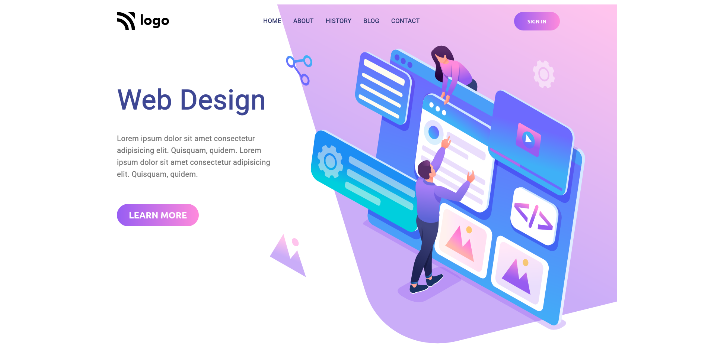

# PROJECT 8 - Design Landing Page

This is the 8th mini-challenge among the 15 Ineuron-projects.

## Table of contents

- [Overview](#overview)
  - [Screenshot](#screenshot)
  - [Links](#links)
- [My process](#my-process)
  - [Built with](#built-with)
  - [Time required](#time-required)
  - [What I learned](#continues-development)
  - [Useful resources](#useful-resources)
- [Author](#author)
- [Acknowledgments](#acknowledgments)

## Overview

### Screenshot



### Links

- Code File URL: [github.com](https://github.com/Jyotimoykathar/Project-08)
- Live Site URL: [netlify.app](https://project-02-restaurant.netlify.app/)

## My process

### Built with

- Semantic HTML5 markup
- CSS custom properties
- Flexbox Css

### Time required

Nearly 4 days required to get the desired page of the project.

### What I learned

This is the css design code snippet of the media queries with attribute selector.

```css
@media (max-width: 84em) {
  .heading-primary {
    font-size: 5rem;
  }
  .description {
    font-size: 1.6rem;
    padding-right: 3.6rem;
  }
  [alt="intro-img"] {
    transform: scale(1.2);
    margin-top: 6rem;
    padding-right: 6rem;
    margin-left: -3rem;
  }
}
```

### Continued development

I still hava lot to learn on different breakpoints of media queries and practise more on image positioning and use on my webpage.

### Useful resources

- [MDN](https://developer.mozilla.org/en-US/) - This website helped me to any thing i had to look upon.

## Author

- Github page- [Jyotimoykathar](https://github.com/Jyotimoykathar/)

## Acknowledgments

Special Thanks to Ineuron team for the mini-challenge to test and improve my CSS flexbox skills.
